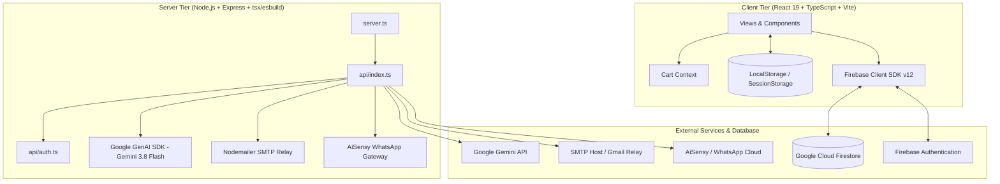

# Tejas Canvassing — Application Audit

**Date:** September 28, 2026  
**Repository:** https://github.com/MAXSTEEL003/tejascanvassingone  
**Platform Domain:** Rice Brokerage, Canvassing, Mandi Logistics & Multi-Stakeholder Trade Platform  
**Target Architecture:** React 19 (SPA) + Express Node.js Server + Google Cloud Firestore & Firebase Auth + Google Gemini 3.8 Flash AI  

---

## 1. Executive Summary

Tejas Canvassing is an operational, specialized rice canvassing and brokerage application built for the South Indian rice trade (primarily Yeshwanthpur APMC Bangalore, Miryalguda, Suryapet, Punjab/Haryana belts). The platform handles the end-to-end lifecycle of rice transactions:
1. **Merchant Portal:** Catalog browsing, variety specifications (1121 Sella, Sona Masoori, HMT Kolam, IR-64, etc.), cart/bag management, godown/shop delivery coordination, and procurement indent requests.
2. **Broker / Admin Headquarters:** Reviewing incoming buyer indents, grouping multiple merchant orders into single mill-level Purchase Orders (POs), transacting with millers, dispatching automated PO contracts via SMTP email and WhatsApp (AiSensy), tracking lorry arrivals via an Excel-like 30+ column spreadsheet registry with Gemini AI camera OCR for lorry receipts (Bilty / LR), monitoring credit terms (overdue payments > 60 days), managing dual-entry financial ledgers (Buyer Debit / Miller Credit), generating traditional Indian agricultural settlement vouchers ("Patti"), and viewing business intelligence analytics.
3. **Warehouse / Staff Operations:** Grain inventory status, quality inspections (moisture %, sortex broken %, chalkiness), and field logistics tasks.

### Key Strengths
- **Authentic Domain Logic:** Implements real-world Indian rice brokerage mechanisms (e.g., L.H. loading & hamali charges, C.C. canvassing commission, TDS, shortage allowances, rate difference adjustments, cheque clearance tracking, and dynamic brokerage formulas: ₹11/Qtl for standard mills, 1% of transaction value for Nidhi Agros).
- **Offline / Local Dual-Write Resilience:** Built with optimistic LocalStorage caching combined with Cloud Firestore dual-writes, allowing mandi operations to continue during intermittent connectivity.
- **Multimodal AI Integration:** Features camera photo OCR via Gemini 3.8 Flash (`/api/scan-manifest`) to parse lorry receipts and bilty slips directly into arrival rows, plus a conversational business analytics copilot (`/api/chat`).
- **Tailored Role Separation:** Role-specific navigation and layouts for `admin`, `employee`, and `merchant`.

### Core Weaknesses & Critical Vulnerabilities
1. **P0 Security Vulnerabilities in Firestore Rules:** Public read access (`allow read: if true;`) on `placed_orders`, `procurement_requests`, and `stakeholders` exposes confidential counterparty data, prices, contact numbers, and GSTINs. Any authenticated user (including basic merchants) can overwrite or delete financial ledgers and arrival entries due to blanket `allow write: if isAuthenticated();`.
2. **P0 Plaintext Passwords & Credential Exposures:** Plaintext passwords committed in `data/employee_credentials.json`, hardcoded admin/employee passwords in `api/auth.ts` and `src/lib/auth.ts`, and an admin authentication bypass header (`x-admin-role: admin`).
3. **P0 Destructive Auto-Scrubbing Logic:** Hardcoded regex and string purges in `App.tsx` and `src/lib/utils.ts` actively wipe out real records containing the names `"ANNAPURNA"` and `"V.K FOODS"` on every application boot, even though both are real counterparties in `actual_data.csv`.
4. **P0 Firestore Duplicate Document Flooding:** `setCollectionDoc` in `src/lib/firebase.ts` writes every document twice (once as `id` and once as `#id`), bloating Firestore operations by 100% and creating deduplication race conditions.
5. **P1 Disconnected Order Details View:** `src/views/OrderDetails.tsx` contains static, hardcoded mock data (Mundra Port, Global Grain Suppliers Ltd., fixed ₹43,49,000) instead of loading the actual order record from Firestore.
6. **P2 Extreme Monolithic Files:** Several files exceed 2,000–4,500 lines of code (`analyticsEngine.ts`: 4,529 lines; `OrdersDashboard.tsx`: 2,974 lines; `ArrivalEntry.tsx`: 2,967 lines; `StoreManagement.tsx`: 2,305 lines), creating high maintenance friction.

---

## 2. Current Architecture



- **Runtime & Build:** Node.js server with Express 4.21, utilizing dynamic Vite middleware mode in development (`tsx server.ts`) and static asset serving in production with an esbuild-bundled CJS runner (`dist/server.cjs`).
- **Database Architecture:** Client-side Google Cloud Firestore SDK direct integration (`tejascanavssingstore`). Network layer forced to long-polling mode (`experimentalForceLongPolling: true`).
- **State Architecture:** Hybrid LocalStorage and Firestore dual-write model. Most views read from `localStorage` on initial mount, fetch from Firestore in parallel, merge into state, and write to both targets upon mutations.

---

## 3. Application Structure

```
tejascanvassingone-main/
├── api/
│   ├── auth.ts                     # PBKDF2 hashing, JWT signing/verifying, employee credential store
│   └── index.ts                    # Express router: /api/chat, /api/scan-manifest, /api/dispatch-*, SMTP & WhatsApp
├── data/
│   ├── actual_data.csv             # Primary real-world trading dataset (April 2026 Mandi Records)
│   └── employee_credentials.json   # Disk-persisted employee credentials (contains plaintext passwords)
├── public/                         # PWA manifest, logos, brand bag artwork (cow.jpg, keshar_kali.png, etc.)
├── src/
│   ├── components/                 # Modals, camera OCR scanner, 3D grain shaders, command palette
│   ├── context/                    # CartContext (B2B Cart state, persistence)
│   ├── layout/                     # MainLayout, Navbar, Sidebar
│   ├── lib/
│   │   ├── analyticsEngine.ts      # 4,529 lines: BI math, 125KB preloaded transactions, XLSX parsers
│   │   ├── auth.ts                 # Client-side auth wrapper, session persistence, role guards
│   │   ├── firebase.ts             # Firestore initialization, collection sync helpers, auto-seeders
│   │   └── utils.ts                # Formatting (INR, dates), supplier name sanitization
│   ├── types/                      # Variety definitions and shader parameters (variety.ts)
│   ├── utils/                      # Delivery locations helper, PO email template generator
│   └── views/                      # 21 application screen views
├── firestore.rules                 # Cloud Firestore security rules
├── firebase-blueprint.json         # Entity schema definitions and collection mappings
├── firebase-applet-config.json     # Firebase web configuration credentials
├── package.json                    # Dependencies and build scripts
├── server.ts                       # Dual-port Express entrypoint with Vite dev server
└── vite.config.ts                  # Vite + Tailwind v4 + React configuration
```

---

## 4. Authentication & Authorization

### How It Works
1. **Merchant Authentication:** Merchants sign in with either a phone number, email, or username via `LoginView.tsx`. The system creates a signed token and persists user details to `localStorage` (`userRole: 'merchant'`).
2. **Employee Authentication:** Staff members log in via `/employee` using credentials stored in `data/employee_credentials.json` or pre-seeded in `api/auth.ts`.
3. **Admin Authentication:** Restricted to two authorized Google accounts (`VITE_ADMIN_GOOGLE_EMAIL_1` = `tejasadinarayan@gmail.com` and `VITE_ADMIN_GOOGLE_EMAIL_2` = `tejascanvassing@gmail.com`) via Google Sign-In popup, or via username/password against `DEFAULT_ADMIN_USER` and `DEFAULT_ADMIN_PASS`.
4. **Token Handling:** The server signs a custom HMAC-SHA256 JWT in `api/auth.ts`. However, `src/lib/auth.ts` also contains a client-side `createClientAuthToken` that synthesizes tokens using `btoa` when offline.

### Issues Identified

#### Issue 4.1: Hardcoded Master Passwords & Secret Keys
- **Problem:** Hardcoded passwords and fallback auth secrets exist in code.
- **Evidence/File:**
  - `api/auth.ts` (lines 7, 11, 206–215):
    ```ts
    const SERVER_AUTH_SECRET = process.env.AUTH_SECRET || "tejas_secure_auth_secret_2026_salt_wholesalemandi";
    const DEFAULT_ADMIN_PASS = process.env.ADMIN_PASSWORD || "adinarayan1977";
    cleanPass === "adinarayan1977" || cleanPass === "tejas1679" || cleanPass === "admin1977" || cleanPass === "wholesale2026" || cleanPass === "tejas" || cleanPass === "admin"
    ```
  - `src/lib/auth.ts` (lines 329, 358, 374): Identical hardcoded passwords.
- **Why It Matters:** Anyone with repo access or inspecting client bundles can authenticate as admin by entering `"tejas"` or `"admin"`.
- **Recommended Solution:** Remove all fallback passwords. Enforce authentication strictly against environment variables or Firebase Auth custom claims.
- **Risk of Changing:** Low. Valid admin must ensure environment variables are configured.

#### Issue 4.2: Admin Authorization Bypass via HTTP Request Headers
- **Problem:** Sensitive admin actions accept unverified custom headers without signature checks.
- **Evidence/File:** `api/auth.ts` (lines 414–416):
  ```ts
  const isAuthorizedAdmin = (
    (payload && payload.role === "admin") ||
    req.headers["x-admin-role"] === "admin" ||
    req.headers["x-auth-role"] === "admin" ||
    (typeof authHeader === "string" && (authHeader.toLowerCase().includes("admin") || authHeader.includes("adinarayan")))
  );
  ```
- **Why It Matters:** Any HTTP client sending header `x-admin-role: admin` can create, update, or delete employee credentials.
- **Recommended Solution:** Remove header sniffing; verify valid HMAC JWT tokens or Firebase ID tokens.
- **Risk of Changing:** Low. Only legitimate requests with valid tokens will be permitted.

#### Issue 4.3: Plaintext Employee Passwords Saved to Disk and Repository
- **Problem:** Employee passwords are saved in plaintext to `data/employee_credentials.json`.
- **Evidence/File:** `data/employee_credentials.json` (lines 8, 19, 30, 42):
  ```json
  "plainPassword": "adinarayan1977"
  ```
- **Why It Matters:** Exposes credentials to anyone with access to the repo or container filesystem.
- **Recommended Solution:** Remove the `plainPassword` field from the data model and disk storage; keep only the PBKDF2 hash and salt.
- **Risk of Changing:** Medium. Existing employee logins must verify against the stored hash instead of plaintext fallback.

---

## 5. Database / Firestore

### Schema & Data Models
Defined in `firebase-blueprint.json` and utilized in `src/lib/firebase.ts`:
- `arrival_entries`: Physical commodity arrivals from mills at destination yards.
- `procurement_requests`: Initial buyer demand orders from the store catalog.
- `placed_orders`: Aggregated PO contracts dispatched to mills.
- `ledgers`: Dual-entry accounting ledgers (Buyer Debit / Supplier Credit).
- `product_inventory`: Catalog items with pricing, brand, and specifications.
- `stakeholders`: Registered counterparties (Suppliers, Buyers, Employees).
- `patti_history`: Historical commission settlement vouchers.
- `complaints`: Support tickets from merchants.

### Issues Identified

#### Issue 5.1: Duplicate Document Writes Bloating Firestore
- **Problem:** `setCollectionDoc` writes every record twice.
- **Evidence/File:** `src/lib/firebase.ts` (lines 293–296):
  ```ts
  await Promise.all([
    setDoc(doc(db, collectionName, rawId), cleanData, { merge: true }),
    setDoc(doc(db, collectionName, `#${rawId}`), cleanData, { merge: true })
  ]);
  ```
- **Why It Matters:** Doubles write costs and query payload sizes. Forces downstream queries to filter out `#` prefixed duplicates.
- **Recommended Solution:** Standardize all ID keys to clean, un-prefixed IDs (e.g., `ORD-101`) and remove the second write.
- **Risk of Changing:** Medium. Requires checking that all queries handle un-prefixed IDs.

#### Issue 5.2: Insecure Firestore Security Rules
- **Problem:** Trade and customer records are publicly readable, while all writes require only basic authentication without role checks.
- **Evidence/File:** `firestore.rules` (lines 42, 49, 66, 76):
  ```
  match /placed_orders/{orderId} {
    allow read: if true;
    allow update, delete: if isAuthenticated();
  }
  match /ledgers/{ledgerId} {
    allow read, write: if isAuthenticated();
  }
  match /stakeholders/{userId} {
    allow read: if true;
  }
  ```
- **Why It Matters:** Unauthenticated actors can scrape pricing, buyers, and order volumes. Any registered merchant can alter or delete ledgers and orders.
- **Recommended Solution:** Update Firestore rules to enforce role-based access checks (e.g., admin custom claims or document owner verification).
- **Risk of Changing:** Medium. Client requests must carry appropriate auth tokens.

#### Issue 5.3: Destructive Automatic Local Storage Scrubbing on Boot
- **Problem:** `App.tsx` actively searches localStorage on boot and purges keys containing `"V.K FOODS"` or `"ANNAPURNA"`.
- **Evidence/File:** `src/App.tsx` (lines 124–156):
  ```ts
  if (val.toUpperCase().includes('V.K') || val.toUpperCase().includes('VK FOODS')) {
    localStorage.setItem('userName', 'Authorized Merchant');
  }
  ...
  if (val.toUpperCase().includes('V.K FOODS') || val.toUpperCase().includes('VK FOODS') || val.toUpperCase().includes('ANNAPURNA')) {
    const safeToPurgeKeys = [
      'arrival_entry_data_v4', 'arrival_entry_sheets_v4', 'placed_orders', 'procurement_requests', 'ledgers', ...
    ];
    if (safeToPurgeKeys.includes(key)) localStorage.removeItem(key);
  }
  ```
- **Why It Matters:** `"V.K FOODS"` is a legitimate buyer and `"ANNAPURNA RICE & AGRO INDUSTRIES"` is a legitimate miller in `actual_data.csv`. This scrub logic actively deletes operational data.
- **Recommended Solution:** Remove the legacy counterparty name scrub from `App.tsx` and `src/lib/utils.ts`.
- **Risk of Changing:** Low. Prevents accidental data deletion.

---

## 6. Products

### Current Implementation
- Catalog products are maintained in Firestore under `product_inventory` and displayed in `ProductInventory.tsx` (Admin/Employee) and `StoreManagement.tsx` (Merchant).
- Each product entry includes: name, brand, price (INR per quintal or bag), packaging type, grain length, category, and visual assets.
- Three.js shaders simulate realistic grain translucency in `RicePouchGraphic.tsx` and `RiceBrandsFlow.tsx` based on parameters defined in `src/types/variety.ts`.

### Issues Identified

#### Issue 6.1: Hardcoded Filter Blocking Products with "prod-" IDs
- **Problem:** `getCollectionDocs` filters out any product whose ID begins with `"prod-"`.
- **Evidence/File:** `src/lib/firebase.ts` (lines 220–225):
  ```ts
  return items.filter(item => {
    const norm = String(item.id || '').trim().toLowerCase().replace(/^#/, '');
    if (norm.startsWith('prod-')) return false;
    return !deletedSet.has(norm);
  });
  ```
- **Why It Matters:** Any product created with a default ID format like `prod-101` is hidden from the UI.
- **Recommended Solution:** Remove the arbitrary `norm.startsWith('prod-')` restriction.
- **Risk of Changing:** Low. Allows normal product ID generation.

---

## 7. Buyers & Millers

### Current Implementation
- Handled in `UsersManagement.tsx`. Counterparties are divided into:
  - **Suppliers (Millers):** E.g., Riddhe Siddhe Rice Industries, Sai Teja Parboiled, Vaishnavi Food Products, Bhagwathi Rice Mills, Nidhi Agros.
  - **Buyers (Wholesale Merchants / Traders):** E.g., Platinum Traders, G.K. Udyog, PCB Traders, Raghuram Enterprises, Sri Rama Cash & Carry.
  - **Staff:** Operations staff, Quality Officers.
- Counterparties have KYC details: GSTIN, mandi locations, contact persons, phone, email, and credit terms.

### Issues Identified

#### Issue 7.1: Annapurna Supplier Forced Sanitization
- **Problem:** `sanitizeSupplierName` strips `"ANNAPURNA"` and forces a fallback.
- **Evidence/File:** `src/lib/utils.ts` (lines 73–76):
  ```ts
  const clean = (rawSupplier || '').trim();
  if (!clean || clean.toUpperCase().includes('ANNAPURNA')) {
    return list.length > 0 ? list[0].name : fallback;
  }
  ```
- **Why It Matters:** Prevents proper display and tracking of shipments from Annapurna Rice & Agro Industries.
- **Recommended Solution:** Remove the hardcoded `"ANNAPURNA"` filter from `src/lib/utils.ts`.
- **Risk of Changing:** Low. Restores accurate supplier attribution.

---

## 8. Orders

### Current Implementation & Workflow
1. **Indent Creation (Merchant):** Merchant selects products in `StoreManagement.tsx`, specifies delivery godown/shop in `CheckoutView.tsx`, and submits. This creates a document in `procurement_requests` with status `"Pending Approval"`.
2. **Review & Grouping (Admin):** Broker opens `OrdersDashboard.tsx`. Individual buyer indents appear under "Unassigned Indents". Admin clicks "Accept" (status becomes `"Awaiting Grouping"`).
3. **Consolidated PO (Batching):** Admin selects multiple indents for the same mill/origin and clicks "Group and Place Batch". This:
   - Creates a consolidated PO document in `placed_orders`.
   - Generates dual ledger entries in `ledgers` via `createLedgerEntriesForOrder()`.
   - Updates original `procurement_requests` to `"Completed"`.
   - Dispatches automated PO email via `/api/dispatch-po` and WhatsApp via `/api/dispatch-whatsapp`.
4. **Transit Tracking:** Placed orders appear in `PlacedOrders.tsx` with progress stages: `Awaiting Settlement` -> `Placed` -> `In Transit` -> `Arrived`.

### Issues Identified

#### Issue 8.1: Disconnected Hardcoded OrderDetails View
- **Problem:** `src/views/OrderDetails.tsx` does not fetch dynamic order data by URL `:id`.
- **Evidence/File:** `src/views/OrderDetails.tsx` (lines 36–50, 413–421, 447–464):
  ```ts
  const grandTotal = 4349000;
  // Hardcoded items: 1121 Sella Rice, 500 QTLS, Global Grain Suppliers Ltd., Amritsar, Rice House Ind. (LLC), Dubai, UAE
  ```
- **Why It Matters:** Clicking on an order from the list shows false, static data instead of the actual contract particulars.
- **Recommended Solution:** Fetch order particulars from `placed_orders` using the `:id` parameter and render real counterparty names, quantities, and line items.
- **Risk of Changing:** Medium. Requires careful mapping of sub-orders and amounts.

---

## 9. Dispatch

### Current Implementation
- **SMTP Email Dispatch:** `/api/dispatch-po` in `api/index.ts` uses `nodemailer` to transmit stylized HTML Purchase Orders (`generateSupplierPOEmailHtml` in `src/utils/poEmailTemplate.ts`). If SMTP credentials are not set, it records a simulated dispatch and generates a `mailto:` fallback.
- **WhatsApp Dispatch:** `/api/dispatch-whatsapp` in `api/index.ts` connects to AiSensy's Campaign API v2 when configured, or provides a 1-click `api.whatsapp.com` URL.
- **SMS Dispatch:** `/api/dispatch-sms` creates native `sms:` protocol links.
- **In-Memory Logging:** Up to 50 recent dispatches are logged in `dispatchHistory` in `api/index.ts`.

### Issues Identified

#### Issue 9.1: Runtime .env Mutation from Endpoints
- **Problem:** `/api/update-smtp-credentials` and `/api/update-aisensy-credentials` write credentials directly into the local `.env` file via `fs.writeFileSync`.
- **Evidence/File:** `api/index.ts` (lines 545–548, 619):
  ```ts
  fs.writeFileSync(envPath, envContent.trim() + "\n", "utf-8");
  ```
- **Why It Matters:** Fails in containerized read-only filesystems (e.g., Cloud Run) and risks committing live API secrets to git.
- **Recommended Solution:** Restrict credential updates to server configuration variables or secret managers.
- **Risk of Changing:** Low. Prevents filesystem write crashes.

---

## 10. Payments

### Current Implementation
- Handled primarily in `PaymentTracking.tsx` and `LedgerManagement.tsx`.
- Connects directly to arrival entries:
  - `noOfDays`: Allowed credit terms (e.g., 7 days, 15 days, 30 days).
  - `noOfDayRec`: Payment status (either `"Cleared"` with cheque/RTGS particulars or days pending).
  - Overdue alerts triggered when `daysOutstanding > 60`.
  - Recording a payment in `PaymentTracking.tsx` updates `arrival_entries` (`chqAm`, `chqNo`, `chqDt`, `bank`, `noOfDayRec: 'Cleared'`).

### Issues Identified

#### Issue 10.1: Dangerous "Delete Whole Pending Loadings" Cascading Wipe
- **Problem:** Clicking "Delete Whole Pending Loadings" wipes all documents from `placed_orders`.
- **Evidence/File:** `src/views/PendingLoadings.tsx` (lines 87–93):
  ```ts
  const cloudDocs = await getCollectionDocs('placed_orders').catch(() => []);
  if (cloudDocs && cloudDocs.length > 0) {
    await Promise.all(cloudDocs.map(doc => deleteCollectionDoc('placed_orders', doc.id)));
  }
  ```
- **Why It Matters:** Wiping pending loadings irreversibly deletes active contracts and PO history.
- **Recommended Solution:** Remove the bulk deletion cascade. If clearing pending loadings is needed, only update the loading status of the affected sub-orders.
- **Risk of Changing:** Low. Protects against catastrophic accidental data loss.

---

## 11. Invoices & Patti Vouchers

### Current Implementation
- Traditional Mandi "Patti" settlement voucher generator in `PattiView.tsx` and `src/components/InlinePattiSlip.tsx`.
- Calculations follow Indian agricultural brokerage conventions:
  $$\text{Gross} = \text{QTLS} \times \text{Rate}$$
  $$\text{Expenses} = \text{L.H. (Loading/Hamali)} + \text{Discount} + \text{Seller Commission} + \text{Shortage} + \text{Diff}$$
  $$\text{Net Amount} = \text{Gross} - \text{Expenses}$$
- Exports to PDF using `html2canvas` and `jsPDF`.

### Issues Identified

#### Issue 11.1: Missing PDF Invoice Generation for Orders
- **Problem:** `OrderDetails.tsx` has buttons labeled "Commercial Invoice" and "Bill of Lading" that only trigger UI alerts or mock downloads.
- **Evidence/File:** `src/views/OrderDetails.tsx` (lines 472–486).
- **Why It Matters:** Users expecting to export or print official Purchase Orders and Tax Invoices cannot do so from the order details view.
- **Recommended Solution:** Wire up `jspdf` and `jspdf-autotable` to generate real PDF POs and Invoices matching the templates in `poEmailTemplate.ts`.
- **Risk of Changing:** Low. Adds a functional feature.

---

## 12. Notifications

### Current Implementation
- `NotificationSettings.tsx` provides configuration toggles for Order Updates, Low Stock Warnings, Payment Reminders, and Security Alerts.
- Includes a live dispatch test bench to test SMTP and WhatsApp endpoints.

### Issues Identified

#### Issue 12.1: Disconnected Push Notifications
- **Problem:** Push notification toggles are purely aesthetic; no Service Worker, Web Push API, or FCM messaging is implemented.
- **Evidence/File:** `src/views/NotificationSettings.tsx` (lines 58–96).
- **Why It Matters:** Users may believe push notifications are active when they are not.
- **Recommended Solution:** Either implement Web Push via Firebase Cloud Messaging or label push toggles as "Coming Soon / In Development".
- **Risk of Changing:** Low. Eliminates misleading UI cues.

---

## 13. Analytics

### Current Implementation
- `AnalyticsDashboard.tsx` and `src/lib/analyticsEngine.ts` provide business intelligence:
  - Monthly transaction volume & turnover trends.
  - Buyer performance scorecards & credit aging.
  - Miller supply distribution & average rates.
  - AI chat copilot (`/api/chat`) with Google Gemini 3.8 Flash grounded on active arrivals, orders, and ledgers.

### Issues Identified

#### Issue 13.1: Massive 125KB Preloaded Dataset in Client Bundle
- **Problem:** `analyticsEngine.ts` contains `PRELOADED_TRANSACTIONS` with thousands of hardcoded historical transaction objects.
- **Evidence/File:** `src/lib/analyticsEngine.ts` (lines 94–3970).
- **Why It Matters:** Bloats the initial JavaScript bundle, slowing down mobile load times.
- **Recommended Solution:** Move static seed data to an external JSON loaded on demand or query it from Firestore.
- **Risk of Changing:** Low. Reduces bundle size significantly.

---

## 14. UI/UX

### Current Implementation
- Design aesthetic: Premium agricultural fintech ("liquid-glass", translucent dark emerald, warm gold `#d4af37`, and deep stone neutrals).
- Dark/Light mode theme switching with system persistence.
- Dynamic global Command Palette (Cmd+K / Ctrl+K) in `CommandPalette.tsx`.

### Issues Identified

#### Issue 14.1: Orphaned and Insecure RoleSwitcher Component
- **Problem:** `src/components/RoleSwitcher.tsx` is an unused component that allows switching user roles to `admin` with a single click.
- **Evidence/File:** `src/components/RoleSwitcher.tsx` (lines 33–74).
- **Why It Matters:** If mounted or accessed, it circumvents authentication controls.
- **Recommended Solution:** Delete `RoleSwitcher.tsx`.
- **Risk of Changing:** Low. Component is not currently imported anywhere.

---

## 15. Mobile Experience

### Current Implementation
- PWA ready: `manifest.json`, high-resolution icons, and `PwaInstallModal.tsx`.
- Native mobile bottom navigation bars (`MerchantBottomBar` and `EmployeeBottomBar`).
- iOS safe-area padding (`env(safe-area-inset-top)` and `env(safe-area-inset-bottom)`).

### Issues Identified

#### Issue 15.1: Horizontal Overflow in Large Spreadsheets
- **Problem:** `ArrivalEntry.tsx` and `PaymentTracking.tsx` contain tables with over 20 columns that require awkward double-axis scrolling on mobile.
- **Evidence/File:** `src/views/ArrivalEntry.tsx` (lines 1400–1650).
- **Why It Matters:** Field staff entering weights or truck numbers on mobile devices face difficult horizontal navigation.
- **Recommended Solution:** Implement a mobile card-view mode or column-visibility toggle for small screens.
- **Risk of Changing:** Low. Improves mobile usability.

---

## 16. Performance

### Current Implementation
- Uses React 19, Recharts, and Tailwind CSS v4.

### Issues Identified

#### Issue 16.1: Lack of Route Code Splitting
- **Problem:** All 21 views and heavy libraries (`three`, `jspdf`, `xlsx`, `recharts`) are imported statically in `App.tsx`.
- **Evidence/File:** `src/App.tsx` (lines 7–27).
- **Why It Matters:** First contentful paint is delayed because the entire application bundle must be downloaded upfront.
- **Recommended Solution:** Introduce `React.lazy()` and `Suspense` for view components in `App.tsx`.
- **Risk of Changing:** Low. Standard optimization.

---

## 17. Security

### Summary of Critical Vulnerabilities

| # | Vulnerability | Severity | File Reference | Impact |
|---|---|---|---|---|
| 1 | Firestore Public Read & Unchecked Write Rules | **P0** | `firestore.rules` | Sensitive trade data exposed; any user can modify ledgers |
| 2 | Hardcoded Passwords & Fallback Secrets | **P0** | `api/auth.ts`, `src/lib/auth.ts` | Complete admin access bypass with trivial passwords |
| 3 | Admin Action Authorization Bypass Header | **P0** | `api/auth.ts:414-416` | Anyone sending `x-admin-role: admin` can manage staff |
| 4 | Plaintext Passwords in Git-Tracked JSON | **P0** | `data/employee_credentials.json` | Credential leakage |
| 5 | Destructive Counterparty Scrubbing on Boot | **P0** | `src/App.tsx:124-156` | Legitimate "ANNAPURNA" and "V.K FOODS" data purged |
| 6 | Runtime .env Modification via API Endpoints | **P1** | `api/index.ts:546,619` | Filesystem write crashes on serverless hosts |

---

## 18. Accessibility

### Issues Identified

#### Issue 18.1: Microscopic Font Sizes in Data Tables
- **Problem:** Several tables use font sizes as small as `8px` or `9px` in uppercase (`text-[8px] font-black uppercase`).
- **Evidence/File:** `src/views/PaymentTracking.tsx` (lines 170, 187, 213).
- **Why It Matters:** Fails WCAG legibility guidelines and causes eye strain in field/warehouse conditions.
- **Recommended Solution:** Increase minimum text size to `11px` / `12px` and enhance contrast.
- **Risk of Changing:** Low. Visual polish only.

---

## 19. Code Quality

### Issues Identified

#### Issue 19.1: Excessive Code Duplication for Counterparty Resolution
- **Problem:** Identical implementations of `resolveBuyerProfile` and `resolveSupplierProfile` are duplicated across multiple views.
- **Evidence/File:**
  - `src/views/OrdersDashboard.tsx` (lines 59–94)
  - `src/views/PaymentTracking.tsx` (lines 61–96)
  - `src/views/CheckoutView.tsx` (lines 47–82)
- **Why It Matters:** Bug fixes made in one file do not propagate to the others.
- **Recommended Solution:** Consolidate into a shared utility function in `src/lib/utils.ts`.
- **Risk of Changing:** Low. Pure refactoring.

---

## 20. Technical Debt

### Issues Identified

#### Issue 20.1: Massive Single-File Components
- **Problem:** Nine files each exceed 1,500 lines of code.
- **Evidence/File:** `analyticsEngine.ts` (4,529 lines), `OrdersDashboard.tsx` (2,974 lines), `ArrivalEntry.tsx` (2,967 lines), `StoreManagement.tsx` (2,305 lines), `ProductInventory.tsx` (1,960 lines), `PlacedOrders.tsx` (1,98KB), `AnalyticsDashboard.tsx` (1,908 lines), `PaymentTracking.tsx` (1,768 lines), `UsersManagement.tsx` (1,661 lines).
- **Why It Matters:** Extremely difficult to debug, test, and maintain.
- **Recommended Solution:** Break sub-components (modals, table rows, filter bars) into dedicated component files incrementally.
- **Risk of Changing:** Medium. Must preserve state and props wiring.

---

## 21. Missing / Weak Functionality

1. **Order Details View:** Currently completely mock and decoupled from real orders in `placed_orders`.
2. **Real-time Firestore Listeners:** Most views rely on manual one-time fetches and localStorage; changes made by one user are not reflected live on other devices without refreshing.
3. **Automated Status Transitions:** Marking an order as "Arrived" does not always sync atomically across `placed_orders`, `arrival_entries`, and `ledgers`.
4. **Push Notifications:** The UI has toggles, but no backend or service worker wiring exists.

---

## 22. Recommended Improvements & Prioritized Roadmap

---

### P0 — Critical (Security, Data Integrity & Broken Features)

1. **Secure Firestore Security Rules (`firestore.rules`):**
   - Close public read on `placed_orders`, `procurement_requests`, and `stakeholders`.
   - Restrict updates and deletions of `ledgers`, `placed_orders`, and `arrival_entries` strictly to authenticated admin/staff users.
2. **Remove Hardcoded Admin Passwords & Bypass Headers (`api/auth.ts`, `src/lib/auth.ts`):**
   - Eliminate hardcoded passwords (`"tejas"`, `"admin"`, `"adinarayan1977"`, `"wholesale2026"`).
   - Remove the `x-admin-role` header sniffing bypass.
3. **Stop Destructive Counterparty Scrubbing on Boot (`src/App.tsx`, `src/lib/utils.ts`):**
   - Remove auto-purge logic that targets `"ANNAPURNA"` and `"V.K FOODS"`.
4. **Stop Firestore Duplicate Document Writing (`src/lib/firebase.ts`):**
   - Remove dual-write of `#${docId}` in `setCollectionDoc`.
5. **Connect Dynamic OrderDetails View (`src/views/OrderDetails.tsx`):**
   - Replace static mock data with real data fetched from `placed_orders`.
6. **Remove Plaintext Passwords (`data/employee_credentials.json`):**
   - Sanitize persisted JSON to keep only cryptographic hashes.

---

### P1 — High Priority (Business Workflow & Usability)

1. **Shared Counterparty Utility (`src/lib/utils.ts`):**
   - Consolidate duplicate `resolveBuyerProfile` and `resolveSupplierProfile` logic.
2. **Real-time Firestore Synchronization:**
   - Introduce `onSnapshot` listeners in `OrdersDashboard.tsx` and `ArrivalEntry.tsx` for multi-user coordination.
3. **Atomic Arrival & Ledger Settlement:**
   - Ensure marking an order as Arrived updates `placed_orders`, `arrival_entries`, and `ledgers` in a single coordinated operation.
4. **PDF Purchase Order & Invoice Generation:**
   - Implement real PDF export in `OrderDetails.tsx` and `PlacedOrders.tsx`.

---

### P2 — Medium Priority (Architecture, Performance & Maintainability)

1. **Route Code Splitting (`src/App.tsx`):**
   - Implement `React.lazy()` for views to reduce initial load time.
2. **Extract Preloaded Dataset (`src/lib/analyticsEngine.ts`):**
   - Move `PRELOADED_TRANSACTIONS` out of the bundle into an async JSON resource.
3. **Decompose Monolithic Views:**
   - Split modals and table components out of `OrdersDashboard.tsx` and `ArrivalEntry.tsx`.
4. **Remove Orphaned Code:**
   - Safely remove unused `RoleSwitcher.tsx`.

---

### P3 — UI/UX (Visual Polish & Accessibility)

1. **Mobile Data Density in Spreadsheets:**
   - Add responsive card-view or column toggles for `ArrivalEntry.tsx` and `PaymentTracking.tsx`.
2. **Table Typography & Contrast:**
   - Increase text size on mobile from `8px`/`9px` to a minimum of `11px`.
3. **Loading Skeletons:**
   - Replace generic spinners with structured skeleton loaders during data fetch.

---

### P4 — Optional (Nice-to-Have Features)

1. **Web Push Notifications (FCM):**
   - Wire Firebase Cloud Messaging to notification toggles.
2. **Export to WhatsApp Share:**
   - 1-click shareable formatted text summary for lorry arrival confirmations to truck drivers.
3. **Multi-language Support:**
   - Add Kannada / Telugu / Hindi UI labels for mandi field workers.
